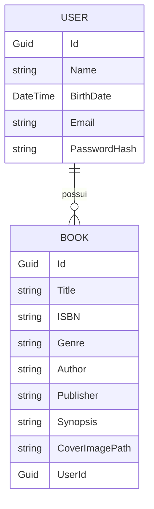

# 📚 BookCatalog – Desafio  

Projeto desenvolvido como parte de um desafio técnico para construção de um **catálogo de livros** com autenticação de usuários, CRUD de livros, envio de e-mails e geração de relatórios em PDF.  

---

## 🚀 Tecnologias Utilizadas
- **.NET 9.0** (Web API)  
- **Entity Framework Core 9**  
- **SQL Server**  
- **JWT Authentication**  
- **AutoMapper**  
- **FluentValidation**  
- **QuestPDF** (relatórios em PDF)  
- **SMTP (System.Net.Mail)** para envio de e-mails  

---

## 🛠️ Funcionalidades

### 👤 Usuário
- Cadastro de usuário com nome, data de nascimento, e-mail/login e senha  
- Login via JWT (autenticação com token)  
- Recuperação de senha (ForgotPassword) com envio de e-mail contendo **callbackUrl**  
- Reset de senha com validação de token  

### 📖 Livro
- Cadastro de livros com:  
  - Título  
  - Nº ISBN  
  - Gênero (select)  
  - Autor  
  - Editora (select)  
  - Sinopse (máx. 5000 caracteres)  
  - Upload de imagem da capa (IFormFile)  
- Listagem de todos os livros do usuário logado  
- Busca por título, ISBN, autor, editora ou gênero  
- Atualização de informações de um livro  
- Exclusão de livros cadastrados  

### 📑 Relatórios
- Geração de relatório em **PDF** com todos os livros cadastrados do usuário logado  

---

## ⚙️ Estrutura do Projeto

```
src/
 ┣ BookCatalog.Api          # WebAPI principal
 ┣ BookCatalog.Core.Domain  # Entidades e contratos
 ┣ BookCatalog.Core.Service # Serviços (Auth, Email, Books etc.)
 ┣ BookCatalog.Infrastructure # Repositórios, DbContext e persistência
 ┗ BookCatalog.Tests        # Testes unitários (opcional)
```

---

## 🔧 Configuração do Ambiente

### Banco de Dados
- SQL Server  
- Ajustar a connection string no `appsettings.json`:  

```json
"ConnectionStrings": {
  "DefaultConnection": "Server=localhost;Database=BookCatalogDb;User Id=sa;Password=SuaSenhaForte;TrustServerCertificate=True"
}
```

### SMTP (Envio de e-mail)
Configuração no `appsettings.json`:

```json
"Smtp": {
  "Host": "smtp.seuprovedor.com",
  "Port": "587",
  "User": "seuemail@dominio.com",
  "Pass": "suasenha"
},
"Frontend": {
  "BaseUrl": "http://localhost:5173" // usado no callbackUrl de reset de senha
}
```

> ⚠️ Para Gmail/Outlook é necessário gerar **Senha de Aplicativo** em vez da senha normal da conta.  

---

## ▶️ Como Executar

1. Clone o repositório:  
   ```bash
   git clone https://github.com/seu-usuario/bookcatalog.git
   cd bookcatalog/src/BookCatalog.Api
   ```

2. Crie o banco de dados e aplique migrations:  
   ```bash
   dotnet ef database update
   ```

3. Execute a API:  
   ```bash
   dotnet run
   ```

4. Acesse no navegador:  
   ```
   https://localhost:5001/swagger
   ```

---

## 📌 Endpoints Principais

### Autenticação
- `POST /api/auth/register` → Registrar usuário  
- `POST /api/auth/login` → Login (retorna JWT)  
- `POST /api/auth/forgot-password` → Recuperar senha (envia e-mail)  
- `POST /api/auth/reset-password` → Redefinir senha  

### Livros
- `GET /api/books` → Listar livros do usuário  
- `GET /api/books/search` → Buscar livros (query params)  
- `POST /api/books` → Cadastrar livro  
- `PUT /api/books/{id}` → Atualizar livro  
- `DELETE /api/books/{id}` → Remover livro  

### Relatórios
- `GET /api/books/report` → Gera relatório em PDF  

---

## 📊 Diagrama de Relacionamento (Mermaid)



---

## 🎭 Diagrama de Casos de Uso (Mermaid UML)

```mermaid
usecaseDiagram
    actor Usuario as U

    U --> (Registrar conta)
    U --> (Login)
    U --> (Esqueci minha senha)
    U --> (Resetar senha)
    U --> (Cadastrar livro)
    U --> (Listar livros)
    U --> (Buscar livro)
    U --> (Atualizar livro)
    U --> (Excluir livro)
    U --> (Gerar relatório PDF)
```

---

## 🧑‍💻 Autor
Desenvolvido por **Tatiane Oliveira** no contexto de um desafio técnico de backend.  
